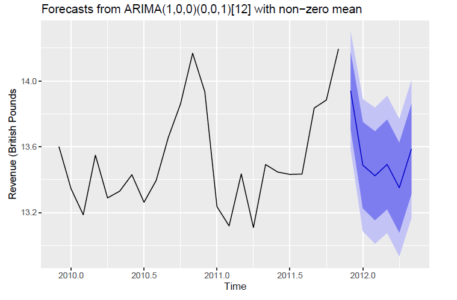
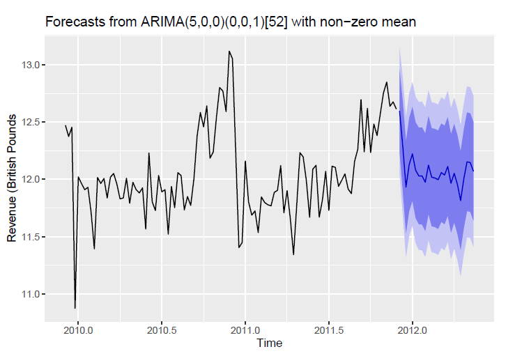

# Retail-Demand-Prediction
Data exploration and forecasting for an online dataset for a UK-based online retailer. Contains invoice data for a period of about 12/2009 - 12/2011.
## Data Exploration
Initial data analysis considered the daily, weekly and monthly sales volumes, with the VWAP (volume weighted average price) of the dataset also considered. Finally, potential influencers based on customer ID, country and product type were considered.
## Time Series Analysis
A range of different forecast models were fitted to both weekly and monthly data. SARIMA models accounting for the seasonal spike in December had the best fit and the most logical looking forecasts:

